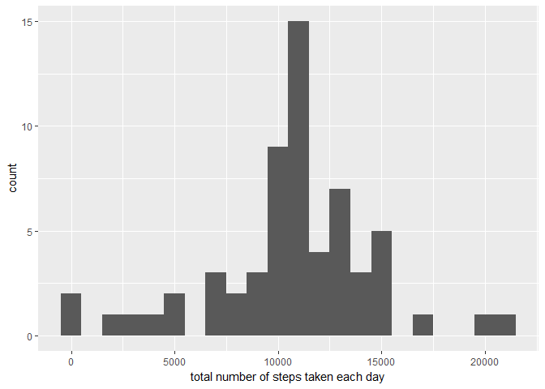

## Loading and preprocessing the data

###Load the data


```r
library(data.table)
```

```
## Warning: package 'data.table' was built under R version 3.4.3
```

```
## data.table 1.10.4.3
```

```
##   The fastest way to learn (by data.table authors): https://www.datacamp.com/courses/data-analysis-the-data-table-way
```

```
##   Documentation: ?data.table, example(data.table) and browseVignettes("data.table")
```

```
##   Release notes, videos and slides: http://r-datatable.com
```

```r
library(ggplot2)
```

```
## Warning: package 'ggplot2' was built under R version 3.4.3
```

```
## Use suppressPackageStartupMessages() to eliminate package startup
## messages.
```

```r
library(knitr)

setwd("C:/Users/Carolina/Documents/Data scientist/reproductible research/RepData_PeerAssessment1-master/RepData_PeerAssessment1-master/")
activityData <- read.csv("activity.csv")
```


###Process/transform the data into a format suitable for your analysis


```r
activityData <- data.table::fread(input = "activity.csv")
```


## What is mean total number of steps taken per day?


```r
library(ggplot2)

total.steps <- tapply(activityData$steps, activityData$date, FUN = sum, na.rm = TRUE)
qplot(total.steps, binwidth = 1000, xlab = "total number of steps taken each day")
```

<!-- -->


```r
mean(total.steps, na.rm = TRUE)
```

```
## [1] 9354.23
```


```r
median(total.steps, na.rm = TRUE)
```

```
## [1] 10395
```


## What is the average daily activity pattern?


```r
library(ggplot2)
averages <- aggregate(x = list(steps = activityData$steps), by = list(interval = activityData$interval), 
    FUN = mean, na.rm = TRUE)
ggplot(data = averages, aes(x = interval, y = steps)) + geom_line() + xlab("5-minute interval") + 
    ylab("average number of steps taken")
```

<!-- -->

On average, which 5-minute interval contains the maximum number of steps?


```r
averages[which.max(averages$steps), ]
```

```
##     interval    steps
## 104      835 206.1698
```


## Imputing missing values


```r
missing <- is.na(activityData$steps)
# How many missing
table(missing)
```

```
## missing
## FALSE  TRUE 
## 15264  2304
```

The missing values are filled in with mean value for the 5-minute interval.


```r
# Replace each missing value with the mean value of its 5-minute interval
fillvalue <- function(steps, interval) {
    filled <- NA
    if (!is.na(steps)) 
        filled <- c(steps) else filled <- (averages[averages$interval == interval, "steps"])
    return(filled)
}
filledData <- activityData
filledData$steps <- mapply(fillvalue, filledData$steps, filledData$interval)
```

Using the filled data set, we are making an histogram of the total number of steps  each day and calculate the mean and median.


```r
totalSteps <- tapply(filledData$steps, filledData$date, FUN = sum)
qplot(totalSteps, binwidth = 1000, xlab = "total number of steps taken each day")
```

<!-- -->


```r
mean(totalSteps)
```

```
## [1] 10766.19
```


```r
median(totalSteps)
```

```
## [1] 10766.19
```


## Are there differences in activity patterns between weekdays and weekends?


```r
filledData$day=ifelse(as.POSIXlt(as.Date(filledData$date))$wday%%6==0,
                          "weekend","weekday")
# For Sunday and Saturday : weekend, Other days : weekday 
filledData$day=factor(filledData$day,levels=c("weekday","weekend"))
```


```r
stepsInterval2=aggregate(steps~interval+day,filledData,mean)
library(lattice)
xyplot(steps~interval|factor(day),data=stepsInterval2,aspect=1/2,type="l")
```

<!-- -->
